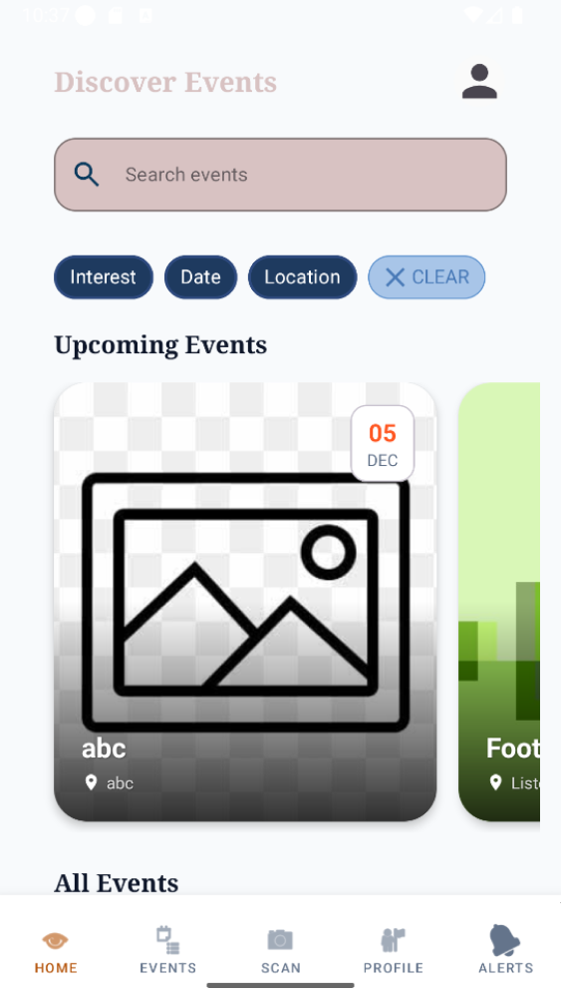
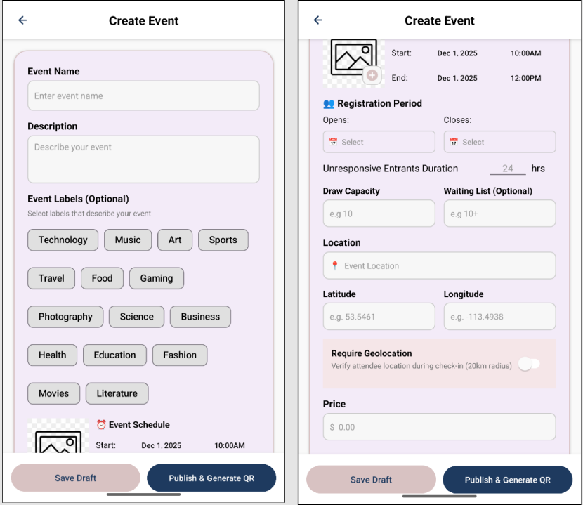

[⬅️Back](../UI-design/ui-main.md)
# Final UI Designs

## Overview

This page showcases the final UI designs for the application, demonstrating the visual direction, user interface components, and overall user experience.

[Figma Link](https://www.figma.com/design/mhHKO6VMWJjie2viA3m7rc/App-UI?node-id=0-1&t=ZvJWi04sCoDymUa7-1)

[User UI Frames](./User%20UI%20Frames.pdf)
[Organizer UI Frames](.//Organizer%20UI%20Frames.pdf)
[Admin UI Frames](./Admin%20UI%20Frames.pdf)

---

## 🎨 Main App Color Palette

### **Primary Colors**
- **Primary Blue:** `#1E3A5F`
- **Primary Background:** `#F9F9F9`
- **Primary Text:** `#0F172A`

### **Secondary Colors**
- **Soft Pink (mist_pink):** `#D8C2C2`
- **Light Warm Pink:** `#F5E6E8`
- **Secondary Text Gray:** `#757575`

### **Accent Colors**
- **Accent Orange:** `#FF5722`
- **Accent Green:** `#00C853`
- **Accent Red:** `#D32F2F`
- **Lottery Gold:** `#B45309`

---

## Screen Designs

### 1. Event List

**Purpose**: Shows friendly guidance when no events match filters; offers CTA to refresh or adjust filters. Fufills many user stories e.g Extends 01.02.01–01.02.02 (browse/filter) with empty-state handling.

**Key Features**:
- Event Search
- Access to event details and immediate joing of waitlist
- Access to wide areas of the app from the home screen

**User Flow**: Navigate to many places in the app. view event details, their events, scan a QR code, profile, all from this page

---

### 2. Event Creation

**Purpose**: Allows organizers to create a new event by filling in key details such as title, date, location, registration window, price and geolocation settings. Addresses 02.01.01, 02.03.01, 02.04.01, by handling event creation and submission to the system. And more user stories like geolocation requirments

**Key Features**:
- Lists all information to be filled for event creation, giving organizer creative control
- Provides option to require geolocation, and set event locaiton

**User Flow**: organizer can enter here and fill out details for their event ot be created. Or back out, or click on lower nav bar to access other parts of the app

---

### 3. Manage Draw

**Purpose**: Displays the waiting list of entrants for a specific event, allowing organizers to initiate or schedule draws. Fulfills many user stories like 02.05.01–02.05.02 which handles random selection and result generation.

**Key Features**:
- Defines the current event
- Tabs that list various information -> keeping organized
- scrolling feature that continues till entrants are listed

**User Flow**: Organizer can access the waiting list, selected, enrolled, and cancelled. All of which have special actions such as notification, replacing, or cancelling.

---

## Design Rationale

### User Research Insights
User research highlighted the need for an interface that feels approachable for users of all ages while still supporting power features for organizers. Participants consistently emphasized the importance of simple navigation, visually gentle colors, and clear access to essential event details. Many users also expressed a desire for more freedom during event creation, noting that overly restrictive forms slow them down. These insights collectively shaped the direction of the app’s visual and interaction design.

### Design Decisions
Based on these findings, the design prioritizes a clean, uncluttered layout with a color palette that is soft on the eyes but still offers strong contrast for readability. Navigation flows were simplified to reduce cognitive load and allow users to move effortlessly across sections of the app. The event creation experience was intentionally built with flexibility, ensuring organizers can input and adjust details without unnecessary friction. Each decision was guided by the goal of helping users make confident choices through clear, accessible information.

### Iterations
The design evolved through multiple rounds of refinement driven by continuous feedback and testing. Early versions were adjusted to improve visual clarity, streamline button placement, and either reduce steps or screen clutter in key flows like event discovery and event creation. 
User feedback also led to emphasizing readability, enhancing color balance, and ensuring that interface elements felt intuitive. Through these iterations, the app moved toward a more polished, user-centered final experience.

---

_Last updated: [2025-12-1]_