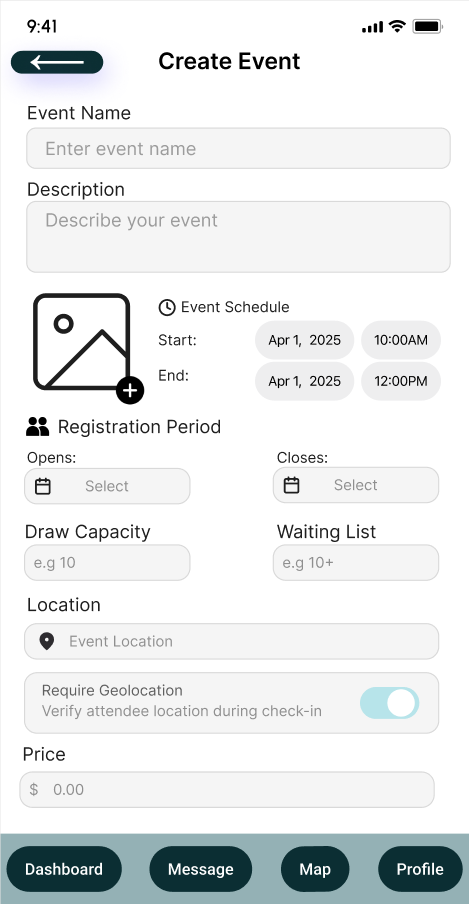

[⬅️Back](../UI-design/ui-main.md)
# Final UI Designs

## Overview

This page showcases the final UI designs for the application, demonstrating the visual direction, user interface components, and overall user experience.

[Figma Link](https://www.figma.com/design/mhHKO6VMWJjie2viA3m7rc/App-UI?node-id=0-1&t=ZvJWi04sCoDymUa7-1)

---

## Design System

### Color Palette

- **Primary**: `#0b2e32` - backgrounds, navigation buttons
- **Secondary**: `#94b1b5` - secondary buttonds
- **Accent**: `#507d82` - small changes in colour through out UI
- **Background**: `#0b2e32` / `#FFFFFF` - Backgrounds
- **Text**: `#FFFFFF` / `#000000` - Used in titles, buttons texts, pops, and more

### Typography

- **Headings**: *****
- **Body Text**: *****
- **Buttons/Labels**: *****

---

## Screen Designs

### 1. Home Screen / Dashboard

**Purpose**: Shows friendly guidance when no events match filters; offers CTA to refresh or adjust filters. Extends 01.02.01–01.02.02 (browse/filter) with empty-state handling.

**Key Features**:
- Event Search
- Access to event details and immediate joing of waitlist
- Access to wide areas of the app from the home screen

**User Flow**: Navigate to many places in the app. view event details, their events, scan a QR code, profile, all from this page

---

### 2. Event Creation

**Purpose**: Allows organizers to create a new event by filling in key details such as title, date, location, registration window, price and geolocation settings. Addresses 02.01.01, 02.03.01, 02.04.01, by handling event creation and submission to the system

**Key Features**:
- Lists all information to be filled for event creation, giving organizer creative control
- Provides option to require geolocation, and set event locaiton

**User Flow**: organizer can enter here and fill out details for their event ot be created. Or back out, or click on lower nav bar to access other parts of the app

---

### 3. Manage Draw

**Purpose**: Displays the waiting list of entrants for a specific event, allowing organizers to initiate or schedule draws. Fulfills 02.05.01–02.05.02, handling random selection and result generation.

**Key Features**:
- Defines the current event
- Tabs that list various information -> keeping organized
- scrolling feature that continues till entrants are listed

**User Flow**: Organizer can access the waiting list, selected, enrolled, and cancelled. All of which have special actions such as notification, replacing, or cancelling.

---

## Design Rationale

### User Research Insights

Brief summary of key findings from user research that informed the design

### Design Decisions

Explanation of major design choices and the reasoning behind them

### Iterations

Overview of how the designs evolved through feedback and testing

---

## Next Steps

- [ ] Developer handoff
- [ ] Design QA during development
- [ ] Usability testing with final implementation
- [ ] Iterate based on user feedback

---
_Last updated: [2025-10-21]_