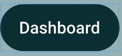

[⬅️Back](../UI-design/ui-main.md)
# 🖼️ UI Mockups

This page contains **rough interface mockups** illustrating where key UI elements (buttons, text, input fields, logos, etc.) are placed and how they will be used.

> These are early sketches meant to visualize layout and component relationships — not final designs.

---

## 📱 Overview
Each mockup below represents a part of the interface, showing **placement**, **proportion**, and **intended interaction**
[Mockup-PDF](./images_OR_assets/Final_%20Mockup%20Interface%20(P2).pdf)

---

### Mockup
| Rough Layout | Description |
|:-------------:|:------------|
|  | **Interaction:** Lets the user authenticate via Email/Password or Device ID to access the app. Includes link to Sign Up and Forgot Password.   **Design intent:** Fulfills 01.01.01 (login), supports 01.01.02 (auth flow completeness).|

---

## 🏠 Example: Home Screen

**Goal:** Display events, navigation buttons and primary actions clearly.

| Mockup | Notes |
|:-------:|:------|
|  | **Interaction:** The Entrant Dashboard displays a list of available, joined, and past events. It includes filters for date and category, helping users quickly find events and navigate to detailed pages.   **Design Intent** Addresses 01.02.01–01.03.02 by showing the user’s active events, supporting event discovery, and linking directly to join/withdraw functionality. |

---

## 🧩 Component Layouts

| Component | Image | Usage Notes |
|------------|:------:|-------------|
| **Button Styles** |  | Primary, secondary, and disabled states. Maintain padding and rounded corners. |
| **Input Fields** |  | Display input fields with placeholder text and labels above. |

---

## 🧠 Usage Intent Summary

| Element | Purpose | Example Location |
|----------|----------|------------------|
| **Buttons** | Trigger user actions (submit, navigate, confirm) | Navigation, detailes, swap user to organzier, access profile |
| **Text Fields** | Capture user input | capture data to create users, events, add information |
| **Icons** | Provide quick visual cues | Navigation bar, Action buttons,  |
| **Logo** | Reinforce branding | App header, splash screen |

---

## 🧾 Notes for Review

- These mockups focus on **structure**, not color or typography. ➡️[Colour/Typography](ui-ideas.md)
- Final design decisions will be reflected in the [Design](./ui-designs.md).
- Feedback on spacing, placement, and usability is welcome before refining visuals.

---

_Last updated: [2025-12-1]_
